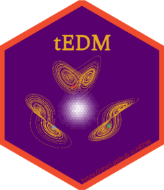

``` r
library(showtext)
showtext_auto(enable = TRUE)
font_add("ShineTypewriter", regular = "./ShineTypewriter-lgwzd.ttf")
library(hexSticker)
library(magick)

sticker(
  subplot = "./EDM.png",
  s_x = 1.035,
  s_y = 0.955,
  s_width = .65,
  s_height = .65,
  package = "tEDM",
  p_family = "ShineTypewriter",
  p_size = 18.5,
  p_x = 1.00,
  p_y = 1.565,
  p_color = "#e6a922",
  dpi = 300,
  asp = 1,
  h_size = 2.25,
  h_color = "#ef4c2d",
  h_fill = "#58006d",
  spotlight = TRUE,
  l_x = 0.935,
  l_y = 0.810,
  l_width = 4.25,
  l_height = 1.55,
  l_alpha = 0.95,
  white_around_sticker = F,
  url = "https://stscl.github.io/tEDM",
  u_color = "#b22222",
  u_size = 5.25,
  filename = "tEDM_logo.png"
)

image_read('./tEDM_logo.png') |> 
  image_resize("240x278")|> 
  image_write('./tEDM_logo.png')
```



**Special thanks to [my girlfriend](https://github.com/layeyo) for her
invaluable help to designing the central EDM figure.**
